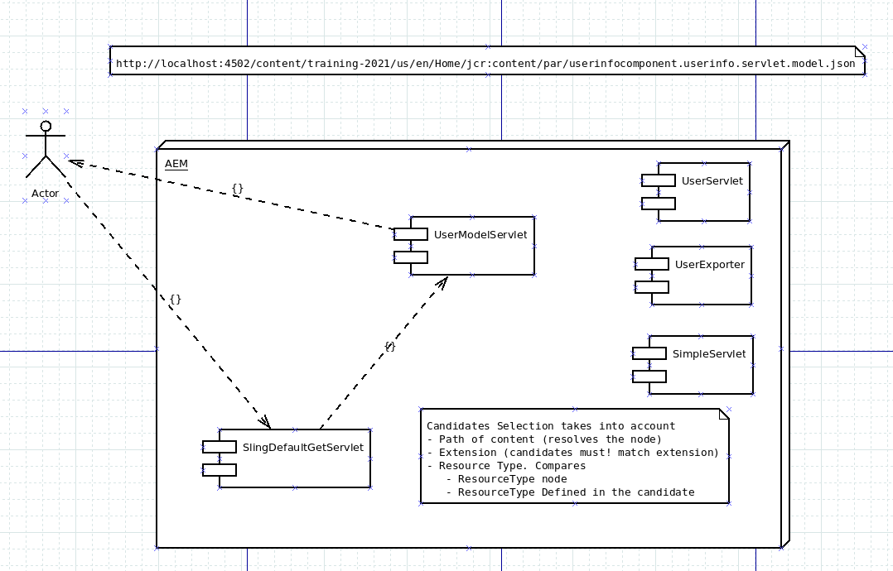

# AEM Training Application

## Usefull commands

### Start Server for debugging

    java -agentlib:jdwp=transport=dt_socket,address=8484,server=y,suspend=n -jar aem-author-p4502.jar -gui
    
### Deploy application

```
    mvn clean install -PautoInstallPackage -PautoInstallBundle  -Padobe-public -DskipTest
    
    -PautoInstallPackage : installs ui.apps with core and configs  included
    -PautoInstallBundle: installs core bundle ONLY
    -DskipTests: optionally skipt unit testing
    -Padobe-public: enables adobe central repo for dependencies
```
## Log files

```
Error log: <aem_install_folder>/crx-quickstart/logs/error.log
Access log: <aem_install_folder>/crx-quickstart/logs/access.log
```

## Usefull links

### CRX DE: explore content, browse nodes, query content...

[http://localhost:4502/crx/de](http://localhost:4502/crx/de)

### Check that the bundle was properly installed:

[http://localhost:4502/system/console/bundles](http://localhost:4502/system/console/bundles)

### Check that the sling models and exporters were installed:

[http://localhost:4502/system/console/adapters](http://localhost:4502/system/console/adapters)

### Sling-Packages declarations in pom.xml

```xml
            <plugin>
                <groupId>biz.aQute.bnd</groupId>
                <artifactId>bnd-maven-plugin</artifactId>
                <executions>
                    <execution>
                        <id>bnd-process</id>
                        <goals>
                            <goal>bnd-process</goal>
                        </goals>
                        <configuration>
                            <bnd><![CDATA[
Import-Package: javax.annotation;version=0.0.0,*
Sling-Model-Packages: com.globant.core.models,com.globant.core.exporters
                                ]]></bnd>
                        </configuration>
                    </execution>
                </executions>
            </plugin>
```

### Other links...
    http://localhost:4502/system/console/servletresolver?url=%2Fcontent%2Ftraining-2021%2Fus%2Fen%2Fcomponents-and-templates-class%2Fjcr%3Acontent%2Froot%2Fcontainer%2Fcontainer%2Fuserinfocomponent.userinfo.servlet.json&method=GET
    https://sling.apache.org/documentation/bundles/models.html
    https://sling.apache.org/

## Test Sling Servlets and Exporters

    http://localhost:4502/content/training-2021/us/en/components-and-templates-class/jcr:content/root/container/container/userinfocomponent.userinfo.userexporter.json
    
## Sling URL Structure

```
    http://localhost:4502/<path_to_content>.<selector_1>.<selector_2>...<selector_N>.<extension>
```

## Sling requests processing

    URL: http://localhost:4502/content/training-2021/us/en/Home/jcr:content/par/userinfocomponent.userinfoservlet.servlet.json
    
    host_port: http://localhost:4502
    
    Path of the content to render: 
        /content/training-2021/us/en/Home/jcr:content/par/userinfocomponent
    Selectors:
        userinfo.servlet
    Extension:
        json

### SlingDefaultGetServlet
    -> URL: http://localhost:4502/content/training-2021/us/en/Home/jcr:content/par/userinfocomponent.userinfoservlet.servlet.json
    -> Process
        -> Filter Candidates [......]
            -> Best Match!
                --> UserServlet!!



## OSGI Components

### Basic component implementation

```java
package com.globant.core.services;

import org.apache.commons.lang3.StringUtils;
import org.osgi.service.component.annotations.Activate;
import org.osgi.service.component.annotations.Component;
import org.osgi.service.component.annotations.Deactivate;
import org.osgi.service.component.annotations.Modified;
import org.osgi.service.metatype.annotations.AttributeDefinition;
import org.osgi.service.metatype.annotations.AttributeType;
import org.osgi.service.metatype.annotations.Designate;
import org.osgi.service.metatype.annotations.ObjectClassDefinition;
import org.slf4j.Logger;
import org.slf4j.LoggerFactory;

@Component(service = HelloWorldService.class)
@Designate(ocd = TrainingAppHelloWorldService.HelloConfig.class)
public class TrainingAppHelloWorldService implements HelloWorldService {
    
    private static final Logger LOGGER = LoggerFactory.getLogger(TrainingAppHelloWorldService.class);
    String prefix = StringUtils.EMPTY;
    String suffix = StringUtils.EMPTY;
    int number;
    
    @ObjectClassDefinition(name = "[AEM Training 2021] hello world configuration", description = "This is sample configuration")
    public @interface HelloConfig {

        @AttributeDefinition(name = "Prefix", defaultValue = "Hello ", description = "Prefix of the salute")
        String prefix();
        
        @AttributeDefinition(name = "Suffix", defaultValue = "!!", description = "Sufix of the salute")
        String suffix();
        
        @AttributeDefinition(name = "Dummy number field", defaultValue = "1", description = "Random number...", type = AttributeType.INTEGER)
        int number();
        
        @AttributeDefinition(name = "String Array Value", defaultValue = {""}, description = "Random number...")
        String[] dummyStringArray();

    }
    
    public String getCustomHelloWorld(String name) {
        return prefix + " " +  name + suffix + " (" + number + ")";
    }
    
    @Activate
    @Modified
    protected void activate(final HelloConfig config) {
        LOGGER.info("Deactivating component...");
        LOGGER.info("Loading properties:");
        prefix = config.prefix();
        LOGGER.info("   * prefix: {}", prefix);
        suffix = config.suffix();
        LOGGER.info("   * suffix: {}", suffix);
        number = config.number();
        LOGGER.info("   * number: {}", number);
        
        // we can load a database url from the properties here...
        // and stablish the connection
        
    }
    
    @Deactivate
    protected void deactivate(final HelloConfig config) {
        LOGGER.info("Deactivating component...");
        
        // close connection, or resources in general
        
    }

}
```
## OSGI Configurations

### File example
Important: OSGI Configuration files MUST have the same name as the full qualified name of the class being configured.

```xml
<?xml version="1.0" encoding="UTF-8"?>
<jcr:root xmlns:sling="http://sling.apache.org/jcr/sling/1.0"
    xmlns:jcr="http://www.jcp.org/jcr/1.0" 
    jcr:primaryType="sling:OsgiConfig"
    prefix="-- This is a configurable prefix --"
    suffix=" -- suffix --"
    number="{Long}0" />
```

### How to add runmodes to instance

[https://helpx.adobe.com/experience-manager/kb/RunModeSetUp.html](https://helpx.adobe.com/experience-manager/kb/RunModeSetUp.html)

```
java -Xmx512m -jar cq-quickstart-6.4.jar -Dsling.run.modes=publish,prod,us
```
"

### AEM Content Querying

### QueryBuilder Example

```
path=/content/training-2021
path.exact=false
1_property=sling:resourceType
1_property.value=training-2021/components/userinfocomponent
2_property=surname
2_property.value=Smith
p.limit=10
```

### SQL2 Example

```
SELECT * FROM [nt:unstructured] AS node
WHERE ISDESCENDANTNODE(node, "/content/training-2021")
AND CONTAINS([surname], "Smith")
```

### QOM Example

```
QueryObjectModelFactory qf = qm.getQOMFactory();
Source source = qf.selector(“nt:folder”, “ntfolder”);
QueryObjectModel query = qf.createQuery(source, null, null,null);
```

### Usefull Links
* [http://www.aemcq5tutorials.com/tutorials/adobe-aem-cq5-tutorials/aem-query-builder/](http://www.aemcq5tutorials.com/tutorials/adobe-aem-cq5-tutorials/aem-query-builder/)
* [https://gist.github.com/floriankraft/8b3720464318cd5cd9e2](https://gist.github.com/floriankraft/8b3720464318cd5cd9e2)

## Templates

## Static Templates
    
    Important!
        if components are not shown in the ui:
            1. 
        * The AEM provided ootb page is located at: 
            /libs/wcm/foundation/components/page
    
    Template definition: /apps/<your_app>/templates
        * Metadata
        * default content: if we have components (structure) in the ui, we can define the values (content) to be displayed by default.
        
    Template implementation: /apps/<your_app>/components/structure
        * Structure definition
        * html files that implement the template
        * We can find page inheritance (sling:resourceSuperType)
        

### Dynamic Templates

    http://www.sgaemsolutions.com/2017/09/dynamic-editable-templates-in-aem-63.html

## Client Libs
    
    http://localhost:4502/libs/granite/ui/content/dumplibs.html

```
    <head data-sly-use.clientLib="${'/libs/granite/sightly/templates/clientlib.html'}">
        <!--for css+js --><meta data-sly-call="${clientLib.all @ categories='your.clientlib'}" data-sly-unwrap></meta>
        <!-- only js --><meta data-sly-call="${clientLib.js @ categories='your.clientlib'}" data-sly-unwrap></meta>
        <!-- only css --><meta data-sly-call="${clientLib.css @ categories='your.clientlib'}" data-sly-unwrap></meta>
    </head>
```